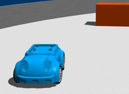

## Saeon's ALTINO

%robot altino images/robots/altino/model.thumbnail.png

The "ALTINO System" is a robot platform designed for education.
It is a four-wheeled robot based on an Ackermann vehicle frame.
It contains many sensors including infrared sensors, a compass and an accelerometer.
More information on the [constructor website](https://www.saeon-altino.com).

### Altino PROTO

Derived from [Car](../automobile/car.md).

```
Altino {
  SFVec3f    translation     0 0.016 0
  SFRotation rotation        0 1 0 1.5708
  SFString   name            "vehicle"
  SFString   controller      "vehicle_driver_altino"
  SFString   controllerArgs  ""
  SFBool     supervisor      FALSE
  SFBool     synchronization TRUE
  SFColor    color           0.3 0.3 0.7
}
```

> **File location**: "WEBOTS\_HOME/projects/robots/saeon/protos/Altino.proto"

#### Altino Field Summary

- `color`: Defines the `diffuseColor` field of the main [Material](../reference/material.md).

### Samples

You will find the following example in this folder: "WEBOTS\_HOME/projects/robots/saeon/worlds".

#### altino.wbt

 This simulation shows the ALTINO model in a simple environment.
The ALTINO controller, written in Python, shows a collision avoidance behavior based on a Braitenberg vehicle.
Alternatively, the vehicle can be controlled manually using the computer keyboard.
Please refer to the Webots console to learn the control keys.
