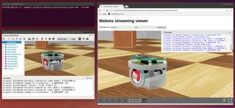

## Web Streaming

### Description

Webots can be used as a Web streaming server, i.e., to stream a simulation to several interactive 3D `HTML` pages, as shown in the [figure below](web-streaming.md#screenshot-of-webots-streaming-server).
In this mode the user can watch an already running simulation and navigate into the scene but cannot interact with the simulation, i.e. controlling the execution of the simulation and modifying the robot controller program.
Please refer to the [Web simulation](web-simulation.md) documentation to setup a platform where users can run individual simulations.

The mechanism is similar to the [web animation export](web-animation.md) except that the `X3D` file and the animation are sent on the fly to the Web browser clients.

%figure "Screenshot of Webots streaming server"



%end

The web interface displays a toolbar with the following items:

- **Simulation time**: this item indicates the current simulation time on the first line.
The second line is not used with this streaming solution.
-  **Console**: open the console window where the simulation messages are printed.
-  **Help**: open the help window containing the documentation of the web interface.
-  **Fullscreen**: enter full screen mode.
-  **Exit fullscreen**: exit full screen mode.

The sample Javascript we provide to communicate with Webots supports advanced features that are not available during the basic broadcast streaming.
This includes controlling the execution of the simulation, modifying the Python robot controller program and displaying the robot windows.
All these functionalities are enabled when starting the streaming using the `simulation_server.py` and `session_server.py` as documented in the [Web simulation](web-simulation.md) section.

### How to Stream a Webots Simulation

Start Webots with the streaming server using the `--stream` option.
Please refer to the [command line documentation](starting-webots.md#command-line-arguments) for details about the sub-options.

Open the streaming viewer page in your Web browser:

```
$(WEBOTS_HOME)/resources/web/streaming_viewer/index.html
```

Use the buttons on the top of the page to connect to the Webots streaming server.

**Note**: `IP` address and port for the streaming server and the client page should match.
The port should not be used by another application.

The streaming functionality use the `X3D` export parameters stored in the [project file](the-standard-file-hierarchy-of-a-project.md#the-project-files).
These parameters are set when [exporting a HTML5 model](web-scene.md#how-to-export-a-web-scene) or [recording an animation](web-animation.md#how-to-export-a-web-animation).

### Network Settings

The Webots streaming server is simply running on the local computer on a given port (`1234` by default, but it can be modified from the [command line arguments](starting-webots.md#command-line-arguments)).
This port should not be used by another application.
In order to be visible from the outside network, the port should be open (e.g. on simple networks, this can be done by modifying the NAT settings of the router).
The firewall of the local computer may complain about this operation, in this case, please modify its settings.

### How to Embed a Web Scene in Your Website

Similarly to [this section](web-animation.md#how-to-embed-a-web-animation-in-your-website), please refer to the streaming viewer page to embed a Webots stream in your Website.

### Scene Refresh Rate

The scene refresh rate is defined by the `WorldInfo.FPS` field.
The same fields than for the [web animation](web-animation.md#limitations) are updated.

### Limitations

The streaming server has the same limitations as the [Web animation](web-animation.md#limitations).
Except that adding and deleting objects from Webots is propagated to the clients.

### Technologies and Limitations

The data is sent to the clients using [WebSockets](https://www.websocket.org/).
In case of related issues, make sure that `WebSockets` are enabled in your Web browser settings.

Please refer to the limitations described in [this section](web-animation.md#remarks-on-the-used-technologies-and-their-limitations).
